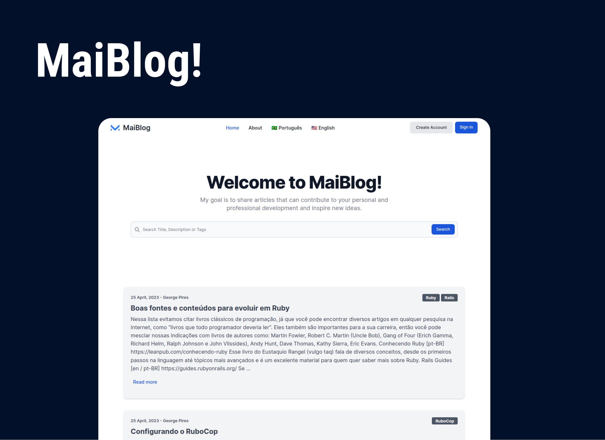

# Teste Técnico - Mainô
<br>
<div align="center">
    
</div>
<br>

## 💻 Projeto

 **MaiBlog**
 - [Deploy - Acesse o projeto](https://maiblog-production.up.railway.app/)

## 🚀 Tecnologias

- Ruby 3.2.2
- Rails 7.0.4
- PostgreSQL
- Hotwire - (Turbo e Stimulus)
- Tailwind CSS
- Importmap
- Action Text
- Gem: Devise
- Gem: Kaminari
- Gem: Ransack
- Deploy ~> Railway.app

## 💥 Funcionalidades

**WEB**
- [x] Idiomas: Inglês e Português
- [x] Cadastrar/Login - Usuário
- [X] Recuperar senha
- [x] Realizar comentários anônimos
- [x] Ver os posts publicados de todos os usários ordenadas por data e hora
- [x] Realizar busca por Título, descrição e tags dos posts 

**USUÁRIO LOGADO**
- [x] Criar e publicar posts
- [x] Adicionar tags aos seus posts
- [x] Realizar comentários registrado
- [x] Editar sua conta
- [x] Alterar senha
- [x] Excluir sua conta

## ⚡ Instalando o Projeto

```bash
# clonar o projeto
git clone git@github.com:GeorgePires/MaiBlog.git

# entre no diretório clonado
cd MaiBlog

# instalar dependências do Ruby on Rails
bundle install

# instalar dependências do Node
npm install

# criar os bancos de dados e adicionar usuário
rails dev:setup

```
```bash
# Usuário e post
    - George: george@gmail.com | senha: 123456
```
```bash
# executar o projeto
./bin/dev 

Entre no endereço: http://localhost:3000
```
